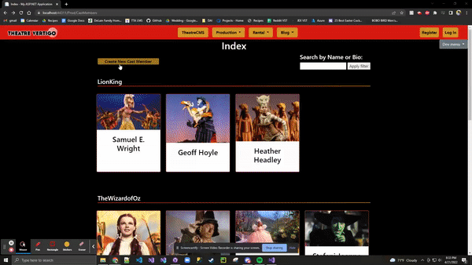

# **C# Projects**
#### These projects demonstrate some facets of my understanding of C#.

## [Car Insurance](https://github.com/jeremydelain/C-Sharp_Projects/tree/main/CarInsurance) 

  This project is an MVC web application that simulates a rudimentary car insurnance website. It takes user's input on policy information and calculates a quote based on business logic. There is also an admin page that allows staff to view all of the quotes that have been issued.

## [Blackjack](https://github.com/jeremydelain/C-Sharp_Projects/tree/main/TwentyOne)

  This console application plays blackjack with you. I really enjoyed developing the class structure and counting logic in this game. There's a good deal of exception handling implemented, but I'm sure there's still plenty of ways to break it.
  
## [Vertigo Theatre](https://github.com/jeremydelain/C-Sharp_Projects/tree/main/VertigoTheatre)

  This project is the most substantial thing I've produced while learning at The Tech Acedemy. I am very proud of the results and I honestly had a ton of fun learning about C#, the .Net Framework, and the structure of MVC based solutions. 
  I was a part of the team working on the "Production" section of the website, and I handled the CRUD for CastMember entites. 
  The create page is a simple form with a file selector for a profile picture:
  
